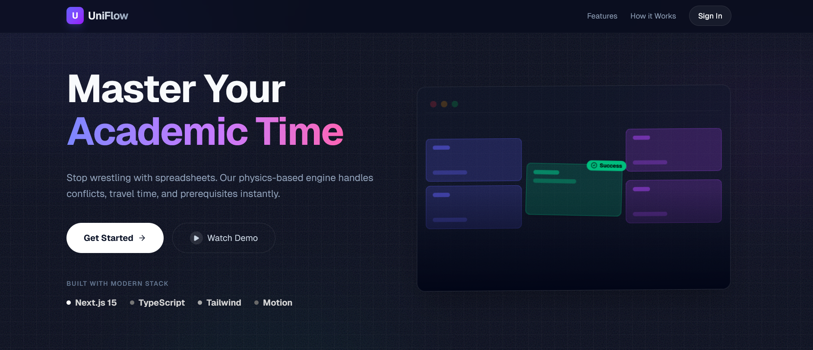
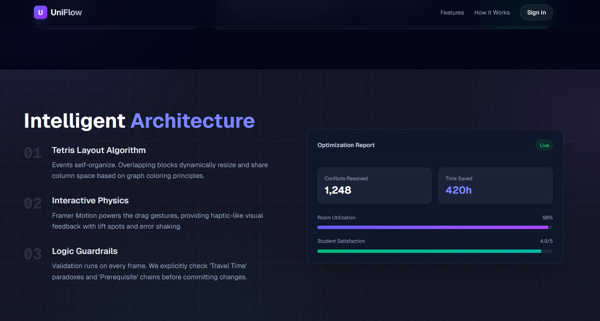
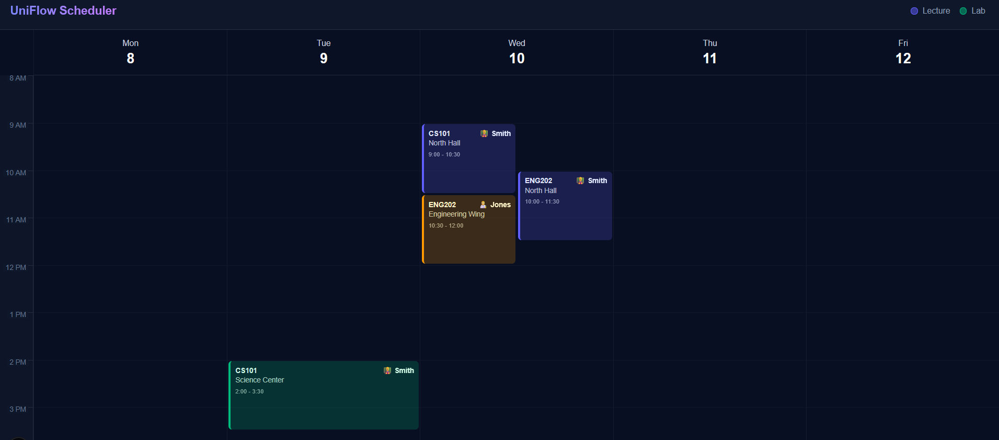
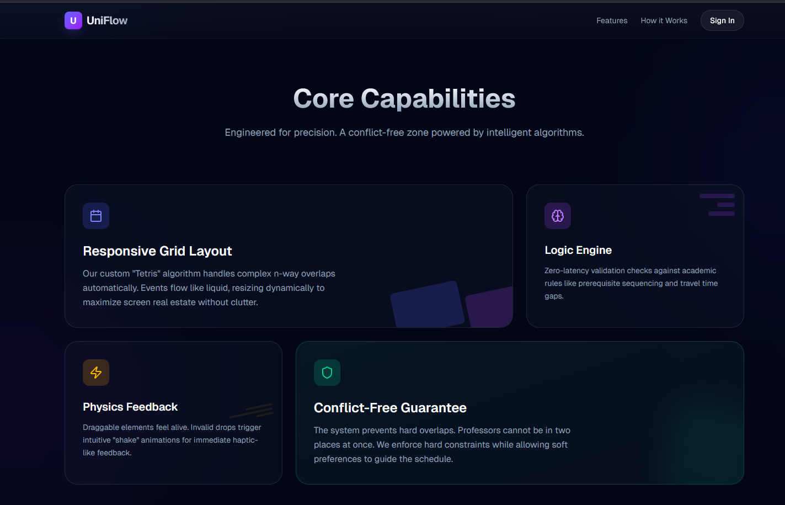

# SmartScheduler

A smart timetable management application built with Next.js.

## Architecture

This application follows a strict Server/Client component split to optimize performance and interactivity.

### Server/Client Split Diagram

```text
  +-------------------------------------+       +-------------------------------------+
  |             SERVER SIDE             |       |             CLIENT SIDE             |
  +-------------------------------------+       +-------------------------------------+
  |                                     |       |                                     |
  |  [ app/layout.tsx ]                 |       |                                     |
  |  Root Layout & HTML Shell           |       |                                     |
  |            |                        |       |                                     |
  |            v                        |       |                                     |
  |  [ app/page.tsx ] ------------------|------>|  [ components/SchedulerClient.tsx ] |
  |  Server Entry Point                 | JSON  |  Interactive UI & State Manager     |
  |                                     |       |            |       |                |
  |                                     |       |            v       v                |
  |                                     |       |      [ lib/logic.ts ]               |
  |                                     |       |      Logic & Helpers       |
  |                                     |       |                                     |
  +-------------------------------------+       +-------------------------------------+
```

### Components

- **Server Components**: 
  - `app/layout.tsx`: Defines the global layout and metadata.
  - `app/page.tsx`: The entry point for the main route, serving as the shell for the application.

- **Client Components**:
  - `components/SchedulerClient.tsx`: The core interactive component that handles state, user inputs, and time management logic.

- **Utilities**:
  - `lib/`: Contains shared types and helper functions.

## Gallery

### Demo Video
[Watch Demo Video](./public/video.mp4)

### Screenshots









---

## Getting Started

This is a [Next.js](https://nextjs.org) project bootstrapped with [`create-next-app`](https://nextjs.org/docs/app/api-reference/cli/create-next-app).

First, run the development server:

```bash
npm run dev
# or
yarn dev
# or
pnpm dev
# or
bun dev
```

Open [http://localhost:3000](http://localhost:3000) with your browser to see the result.

You can start editing the page by modifying `app/page.tsx`. The page auto-updates as you edit the file.

This project uses [`next/font`](https://nextjs.org/docs/app/building-your-application/optimizing/fonts) to automatically optimize and load [Geist](https://vercel.com/font), a new font family for Vercel.


## Deploy on Vercel

The easiest way to deploy your Next.js app is to use the [Vercel Platform](https://vercel.com/new?utm_medium=default-template&filter=next.js&utm_source=create-next-app&utm_campaign=create-next-app-readme) from the creators of Next.js.

Check out our [Next.js deployment documentation](https://nextjs.org/docs/app/building-your-application/deploying) for more details.
